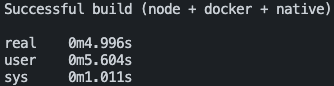

# origin

Build a portable API or CLI that runs anywhere, with node, docker, native binaries, and cloud deployment.


## Introduction

Build a cross-platform API, CLI, or UI with zero configuration; build for all platforms in < 5 seconds.

Generates a node module, a docker image, native binaries for win, macos, and linux, and instantly 
deployable cloud configurations for your project.

Use the entire TypeScript, Node, NPM, and AWS CDK ecosystem while building your app.

## Quickstart

Use the GitHub ["Use this template"](https://github.com/khalidx/origin/generate) button or copy just the files you need from this repo with this one-liner:

```bash
wget https://github.com/khalidx/origin/archive/master.zip && unzip -d origin/ master.zip && rm master.zip
```

Launch the application in dev mode.

```bash
# clone this repo, and npm install, then:

npm run dev
```

The default boilerplate starts a node express API on port 3000.

Build the application for (node + docker + native) platforms.

```bash
npm run build
```

Usually, it builds for (node + docker + native) in under 5 seconds. 



> *above* | A timed build on a bogged down busy 15-inch Macbook Pro with a zillion Chrome tabs open :)

After building, you have many options for launching your app, or
running it on another platform or machine, or in the cloud.

```bash
npm run start

# or, for the full option list

npm run start:typescript
npm run start:node
npm run start:docker
npm run start:native:win
npm run start:native:macos
npm run start:native:linux

# you can also run with docker directly

docker run --rm -it -p 3000:3000 origin

# or run it with the native binary for your OS

./exec/origin-win.exe
./exec/origin-macos
./exec/origin-linux
```

You can also deploy instantly. Try this command:

```bash
npm run deploy
```

The following environment variables are **required**:

- `ORIGIN_AWS_STACK_NAME`
- `ORIGIN_AWS_SUBDOMAIN`
- `ORIGIN_AWS_HOSTED_ZONE_NAME`
- `ORIGIN_AWS_HOSTED_ZONE_ID`
- `ORIGIN_AWS_CERTIFICATE_ARN`

The following environment variables are *optional*:

- `ORIGIN_AWS_INSTANCES` (min: `1` | default: `3`)

Here's how you would use the `npm run deploy` command, with example values for the environment variables:

```bash
ORIGIN_AWS_STACK_NAME="my-app" \
ORIGIN_AWS_SUBDOMAIN="my-app.example.com" \
ORIGIN_AWS_HOSTED_ZONE_NAME="example.com" \
ORIGIN_AWS_HOSTED_ZONE_ID="<Route53 HostedZoneId>" \
ORIGIN_AWS_CERTIFICATE_ARN="arn:aws:acm:us-east-1:<ACCOUNT>:certificate/<ID>" \
ORIGIN_AWS_INSTANCES="1" \
npm run deploy
```

> Make sure you're logged in to AWS.
> You'll also need to have a domain name and certificate
> registered in Route53 for exposing services. Read more in
> the [complete deployment guide for AWS](./aws.md)
> (Azure, GCP, Digital Ocean, and Vercel coming soon).

This repository provides a simple, low-overhead build chain for
creating cross-platform applications, so that developers can focus
on writing great APIs, CLIs, and UIs that can run virtually anywhere.
